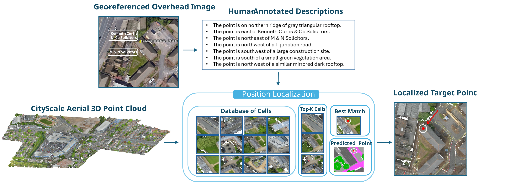

# AerialLoc: A Dataset and Benchmark for Language-Based 3D Position Localization in City-Scale Aerial Point Clouds

## Overview

AerialLoc introduces a dataset and benchmark for localizing 3D positions in city-scale aerial point clouds from natural-language descriptions of their surroundings. It pairs target positions with human-annotated descriptions that capture surrounding objects, landmarks, and spatial relationships. The benchmark supports global place recognition and fine localization, with a Benchmark Adaptation Pipeline that enables evaluation using existing coarse-to-fine localization models.

<p align="center">
  
</p>

<p align="center">
  <em>Conceptual overview of language-based 3D position localization in AerialLoc.</em>
</p>


## Dataset

AerialLoc is built on the aerial photogrammetric point-cloud scenes of SensatUrban through georeferencing and spatial target sampling. Point-centered overhead imagery is used to support annotation, while the final benchmark pairs the sampled 3D locations with human-refined descriptions validated against the corresponding point-cloud scenes. In total, AerialLoc spans 38 aerial scenes across Birmingham and Cambridge, covering approximately 6 km², with 44,730 textual descriptions and 2,157 landmarks.


### Representative Annotations

Representative final annotations from AerialLoc, showing point-centered aerial views and their corresponding human-refined descriptions.

<div align="center">
  
</div>


## Dataset Download


The AerialLoc dataset can be downloaded from the given [download link](https://docs.google.com/forms/d/e/1FAIpQLScAu-up_UeIOYu0NTVjZVInO8PJTVkYu9q72pmJZFRdp52JRQ/viewform?usp=publish-editor).


## Benchmark Tasks and Baseline Results

AerialLoc evaluates language-based 3D position localization through two stages of a coarse-to-fine localization pipeline.

### Global Place Recognition
Given a natural-language query, the global place recognition stage retrieves the top-\(k\) candidate cells from the AerialLoc cell database. The objective is to identify the spatial cell associated with the target position among the retrieved candidates.

The baseline achieves the following Cell Retrieval Recall on the AerialLoc test split:
<div align="center">

<table>
  <thead>
    <tr>
      <th>k</th>
      <th>Cell Retrieval Recall@k (%) ↑</th>
    </tr>
  </thead>
  <tbody>
    <tr>
      <td align="center">1</td>
      <td align="center">3.43</td>
    </tr>
    <tr>
      <td align="center">3</td>
      <td align="center">7.21</td>
    </tr>
    <tr>
      <td align="center">5</td>
      <td align="center">10.28</td>
    </tr>
    <tr>
      <td align="center">10</td>
      <td align="center">16.10</td>
    </tr>
  </tbody>
</table>

</div>


### Fine Localization

Given the retrieved candidate cells, the fine localization stage estimates the target position within each candidate cell using the textual query and the corresponding cell representation. These local predictions are mapped back to the scene-level coordinate frame to obtain the final position estimate.


The baseline achieves the following Fine Localization Recall on the AerialLoc test split under different spatial thresholds:


<div align="center">

<table>
  <thead>
    <tr>
      <th rowspan="2" align="center">Spatial threshold ε (m)</th>
      <th colspan="4" align="center">Fine Localization Recall@k (%) ↑</th>
    </tr>
    <tr>
      <th align="center">k = 1</th>
      <th align="center">k = 3</th>
      <th align="center">k = 5</th>
      <th align="center">k = 10</th>
    </tr>
  </thead>
  <tbody>
    <tr>
      <td align="center">5</td>
      <td align="center">3.43</td>
      <td align="center">5.61</td>
      <td align="center">6.85</td>
      <td align="center">9.35</td>
    </tr>
    <tr>
      <td align="center">10</td>
      <td align="center">4.47</td>
      <td align="center">7.23</td>
      <td align="center">8.10</td>
      <td align="center">13.08</td>
    </tr>
    <tr>
      <td align="center">15</td>
      <td align="center">5.09</td>
      <td align="center">8.02</td>
      <td align="center">10.21</td>
      <td align="center">14.87</td>
    </tr>
    <tr>
      <td align="center">20</td>
      <td align="center">6.12</td>
      <td align="center">10.41</td>
      <td align="center">12.91</td>
      <td align="center">17.93</td>
    </tr>
  </tbody>
</table>

</div>


## Setup


### Training

Baseline Text2Loc model can be trained using the following command:

### Global Place Recognition


```bash
python -m training.coarse \
  --dataset aerialloc \
  --no_pc_augment \
  --batch_size 64 \
  --learning_rate 0.0005 \
  --coarse_embed_dim 256 \
  --shuffle \
  --base_path ./data/out_30-10_gridCells_pd35_pc4_all_nm-6 \
  --hungging_model t5-large \
  --folder_name PATH_TO_COARSE \
  --epochs 100
```

### Fine Localization 


```bash
  python -m training.fine \
   --dataset aerialloc \
  --use_features "class"  "color"  "position"  "num" \
  --no_pc_augment \
  --fixed_embedding \
  --regressor_cell all \
  --batch_size 32 \
  --hungging_model t5-large \
  --learning_rate 0.00003 \
  --shuffle \
  --base_path ./data/out_30-10_gridCells_pd35_pc4_all_nm-6 \
  --epochs 50 \
  --folder_name PATH_TO_FINE
  --num_mentioned 10 \
  --enforce_fixed_num_mentioned 0
```


### Evaluation
```bash
python -m evaluation.pipeline \
  --dataset aerialloc \
  --base_path ./data/out_30-10_gridCells_pd35_pc4_all_nm-6 \
  --use_features "class" "color" "position" "num" \
  --no_pc_augment \
  --no_pc_augment_fine \
  --hungging_model t5-large \
  --fixed_embedding \
  --path_coarse ./checkpoints/{PATH_TO_COARSE}/{COARSE_MODEL_NAME} \
  --path_fine ./checkpoints/{PATH_TO_FINE}/{FINE_MODEL_NAME} 
```
### Pre-trained Models

You can access the pre-trained models [here](https://drive.google.com/drive/folders/1N9-5zk7tpePSpq1M_Ga6HN3huFFrWqJn?usp=sharing). To run the evaluation, save them as follows:

```bash
./checkpoints/coarse.pth
./checkpoints/fine.pth
```

## Acknowledgements

We would like to thank the authors of the following codebases:

- [Text2Loc](https://github.com/Yan-Xia/Text2Loc)
- [SoftGroup](https://github.com/thangvubk/SoftGroup)
